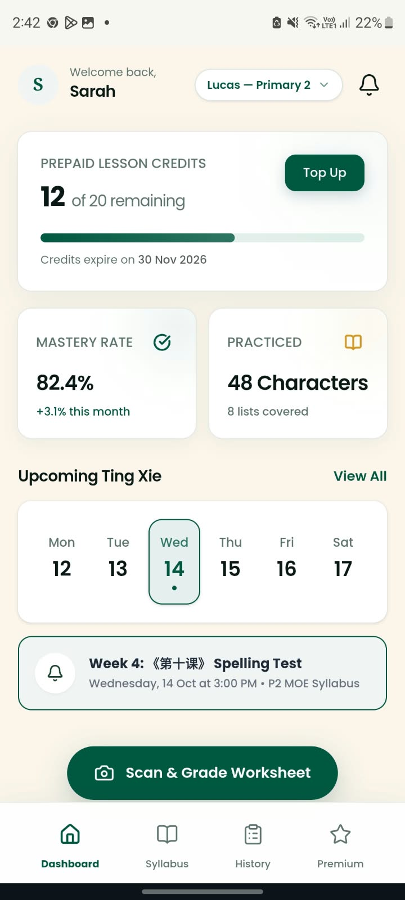
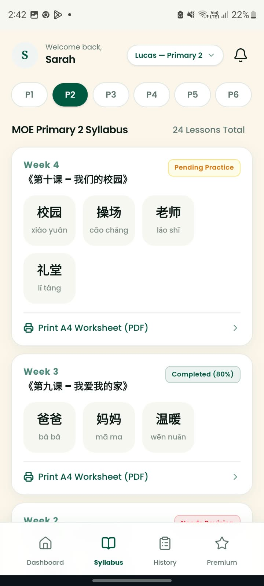
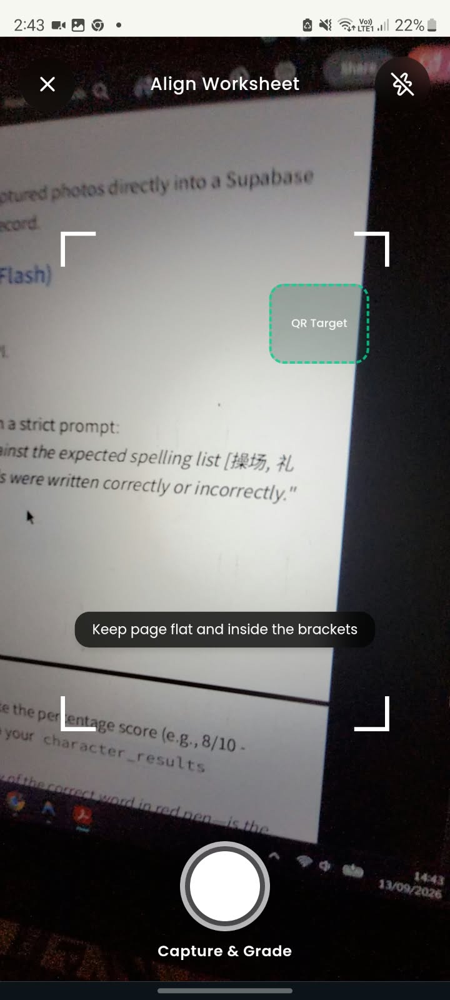
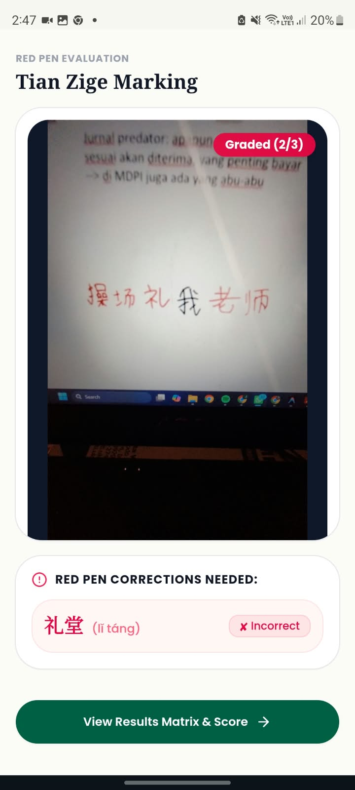
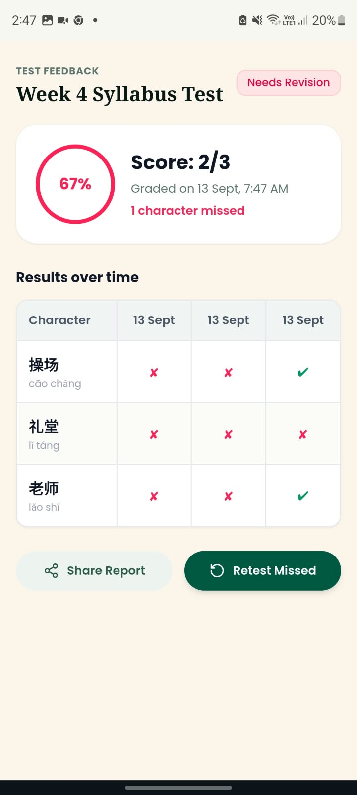
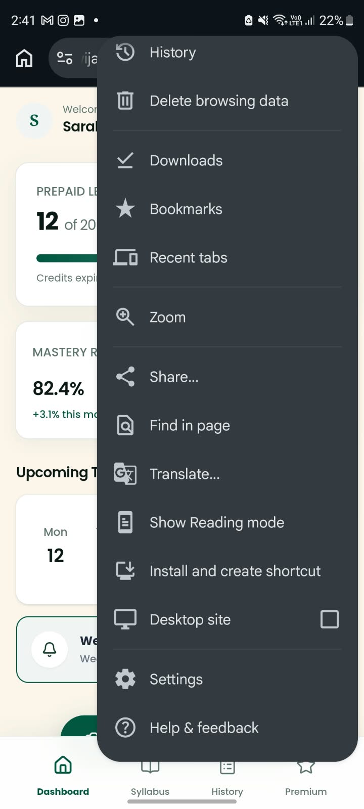
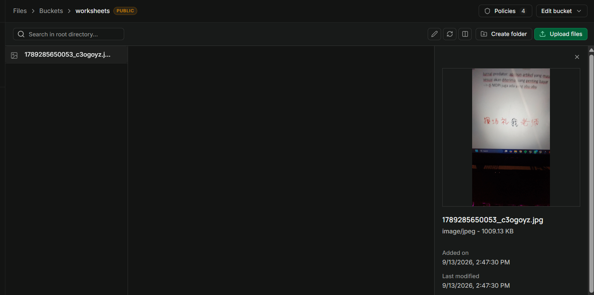
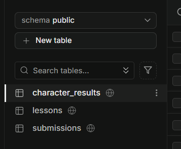

# 📝 AI-Powered Chinese Handwriting Grading App (PWA)

> **CONFIDENTIALITY & ASSESSMENT NOTICE**  
> This repository contains a technical assessment project developed exclusively by **Jonathan Wijaya** for recruitment evaluation purposes. All rights reserved © 2026. Unauthorized commercial reuse, distribution, or extraction outside of this recruitment evaluation is strictly prohibited.

> *Note on Testing*: This project utilizes **Free-Tier services** (including Google Gemini API rate limits and free-tier cloud hosting). If you encounter temporary latency or rate-limit responses during live testing, please refer to the provided **App Screenshots & Visual Flow** section below, which documents the end-to-end functionality verified during testing.

---

## 🚀 Live Deployment
* **Live Demo URL**: `https://jonathanwijayafed.vercel.app/` 
---

## 📌 Overview & Scope
A Mobile-First Progressive Web Application (PWA) designed to grade Primary Chinese handwriting worksheets using Gemini AI Vision. The app tracks student syllabus progress, captures Tian Zige grid worksheets via a native camera interface, and provides real-time red-pen overlay feedback alongside historical performance matrices.

---
## 📸 App Screenshots & Visual Flow

### 📱 Front-End UI & Scanner Flow
| Dashboard (Screen 1) | Syllabus Tracking (Screen 2) | Camera Viewfinder (Screen 3) |
| :---: | :---: | :---: |
|  |  |  |

| Red-Pen Overlay Evaluation | Results Matrix & Score (Screen 4) | PWA Installation |
| :---: | :---: | :---: |
|  |  |  |

### 🗄️ Back-End & Supabase Verification
| Supabase Storage Bucket (`worksheets`) | PostgreSQL Database Schema |
| :---: | :---: |
|  |  |

---

## ✅ Completed Features Breakdown

All minimum requirements and technical specifications across **Screens 1 to 5** have been fully implemented:

### 1. Front-End UI & Dashboard (Screens 1 & 2)
* **Dashboard (Screen 1)**: Integrated student profile (`Lucas - Primary 2`), Prepaid Lesson Credits card (`12 of 20 remaining`), and weekly calendar strip.
* **Syllabus Tracking (Screen 2)**: Built dynamic P1–P6 MOE level tab selector pills and expandable lesson cards with vocabulary lists (e.g., 《第十课 - 我们的校园》) paired with status tags (`Pending Practice`, `Completed`).
* **PWA Setup**: Formatted manifest settings, web application viewport configurations, and safe-area adjustments for mobile home-screen installation.

### 2. Camera Viewfinder & Worksheet Capture (Screen 3)
* **HTML5 MediaDevices API**: Integrated native rear-camera stream (`navigator.mediaDevices.getUserMedia`).
* **Live Overlay**: Implemented alignment frame overlay with corner guides, instruction prompts, and shutter controls.
* **Capture Pipeline**: Programmed high-resolution frame capture from canvas, converting images to Blob files for backend submission.

### 3. Back-End Database & Storage Pipeline
* **Supabase Integration**: Modeled PostgreSQL tables (`lessons`, `submissions`, `character_results`) with relational foreign keys.
* **Storage Bucket Upload**: Engineered `POST /api/upload` route handling multipart form data and uploading images to Supabase Storage.

### 4. AI Vision Grading Engine & Red-Pen Feedback Flow
* **Gemini AI Vision Integration**: Connected backend route to Google Gemini AI Engine (`gemini-3.6-flash`).
* **Prompt Engineering**: Engineered structured JSON responses evaluating Tian Zige handwritten characters against expected vocabulary (`操场`, `礼堂`, `老师`).
* **Red-Pen Overlay & Score Calculation (Screen 5)**: Automated percentage calculation and status parsing, returning character-level evaluations to the front end for visual feedback overlays.

### 5. Historical Matrix & Feedback Results (Screen 4)
* **Dynamic Score Header**: Displays calculated score (e.g., `Score: 2/3`), status pills (`Needs Revision` / `Passed`), and timestamp (`Graded on 12 Sep, 6:16 PM`).
* **Historical Matrix Table**: Dynamically maps historic test dates (`12 Sep`) and status indicators (`✓ Correct` vs `✘ Incorrect`) based on Supabase submission history.

---

## 🛠 Tech Stack

* **Framework**: Next.js (App Router, Dynamic Routing, Route Handlers)
* **Styling & Fonts**: Tailwind CSS, Custom Parchment Theme, Lexend & Poppins Fonts
* **Database & Storage**: Supabase (PostgreSQL & Object Storage)
* **AI Vision Engine**: Google Gemini API (`@google/genai`) from Google AI Studio
* **Icons**: Lucide React
* **Deployment**: Vercel

---